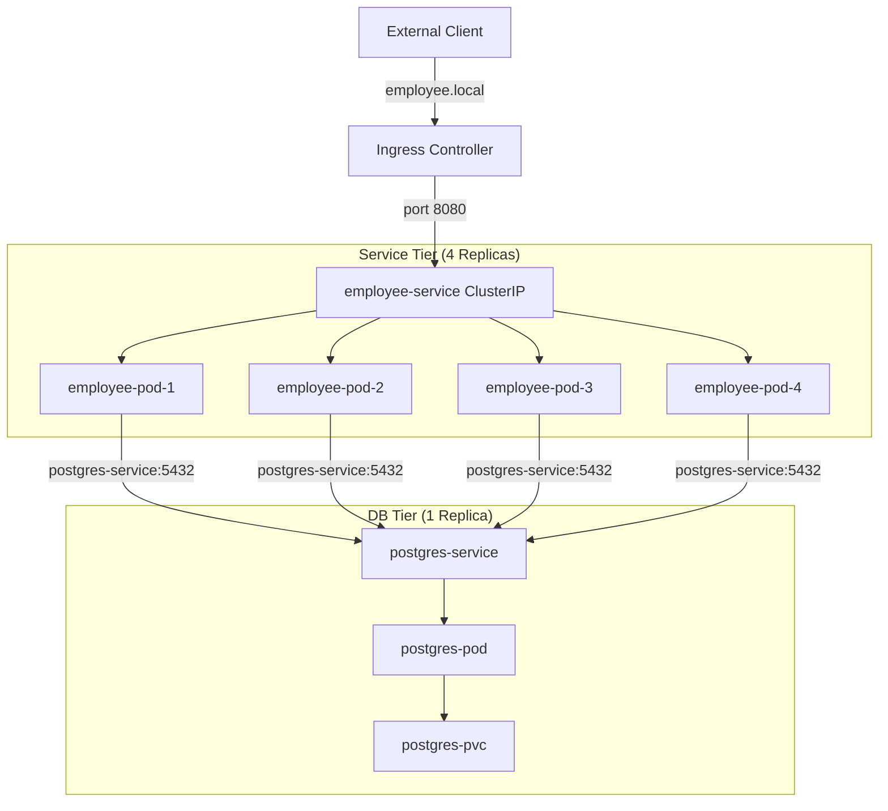

# Kubernetes, DevOps & FinOps - Employee Service Assignment

This project is a simple containerized Spring Boot REST service (`employee-service`) that connects to a PostgreSQL database on Kubernetes. It was built for the NAGP 2026 DevOps/Kubernetes workshop.

---

## Deliverables Links
*   **Repository:** [https://github.com/kumarlalit002/nagp-employee-service](https://github.com/kumarlalit002/nagp-employee-service)
*   **Docker Image:** [https://hub.docker.com/r/kumarlalit002/employee-service](https://hub.docker.com/r/kumarlalit002/employee-service)
*   **Local API Endpoint:** [http://employee.local/employees](http://employee.local/employees)
*   **Demo Video:** [Google Drive Demo Video](https://drive.google.com/file/d/1AkIWwSSiRyCVZPb2918BlZaAkPmkRHwm/view?usp=drive_link)

---

## 1. Quick Architecture Overview

Here is how the components talk to each other:



*   **Database Config:** Managed outside the pods via a ConfigMap (`DB_HOST`, `DB_PORT`, etc.) and a Secret for the password.
*   **No Hardcoded IPs:** The API tier reaches the database using the cluster-internal DNS name `postgres-service`.

---

## 2. Assumptions
*   Tested on a local Minikube cluster.
*   `ingress` and `metrics-server` addons are enabled in Minikube.
*   Default dynamic storage provisioning is available for the PVC.

---

## 3. Resource Allocations (Justification)

### Service API (employee-deployment)
*   **Replicas:** 4 pods (for high availability and rolling updates).
*   **Memory (512Mi request / 768Mi limit):** Spring Boot starts up comfortably at ~300-400MB. Setting request to 512Mi prevents OOM restarts on startup, with 768Mi headroom for traffic spikes.
*   **CPU (250m request / 500m limit):** Restricts the JVM to a max of 0.5 cores so it doesn't hog the nodes during startup.

### Database (postgres-deployment)
*   **Replicas:** 1 pod (standard single-instance DB with volume lock).
*   **Memory (256Mi request / 512Mi limit) & CPU (100m request / 500m limit):** Lightweight settings since we are only querying a table with 5-10 records.

---

## 4. FinOps Cost Optimization Strategies

Here are three ways we optimized the setup to keep costs down:

1.  **Lightweight Base Image:** Used a multi-stage Docker build. We compiled the app using a Maven builder image but discarded it afterwards, using a minimal Alpine JRE image (`eclipse-temurin:17-jre-alpine`) for the runner. This cut the final image size from 600MB+ to around 150MB, saving registry storage fees and bandwidth.
2.  **Horizontal Pod Autoscaler (HPA):** Instead of running 10 static pods all the time, we set a baseline of 4 replicas. The HPA scales the pods up dynamically (up to 10) only when CPU load exceeds 50%.
3.  **Right-Sizing based on Metrics:** In a production setup, we can monitor the pods via Prometheus or `kubectl top pods`. By aligning CPU/Memory requests closer to actual usage (e.g., dropping memory requests to 384Mi if idle usage is low), we increase pod density per node and reduce the number of cloud VMs needed.

---

## 5. Deployment Steps

Manifests are under the `k8s/` directory.

### 1. Build and Push Image
```bash
docker build -t <dockerhub-user>/employee-service:latest .
docker push <dockerhub-user>/employee-service:latest
```

### 2. Deploy PostgreSQL
```bash
kubectl apply -f k8s/postgres-pvc.yaml
kubectl apply -f k8s/postgres-secret.yaml
kubectl apply -f k8s/postgres-deployment.yaml
kubectl apply -f k8s/postgres-service.yaml
```

### 3. Deploy API Service
```bash
kubectl apply -f k8s/employee-configmap.yaml
kubectl apply -f k8s/employee-deployment.yaml
kubectl apply -f k8s/employee-service.yaml
kubectl apply -f k8s/employee-ingress.yaml
kubectl apply -f k8s/employee-hpa.yaml
```

### 4. Setup Host Mapping
Run `kubectl get ingress` to get the Ingress address (or `minikube ip`). Map it in your hosts file:
```text
<INGRESS_IP> employee.local
```

### 5. Verify the API
```bash
curl http://employee.local/employees
```

---

## 6. Screen Recording Walkthrough Steps

If you are recording the demo video, here is a quick sequence to follow:

1.  **Show All Resources Running:**
    ```bash
    kubectl get all
    kubectl get ingress
    kubectl get hpa
    ```
2.  **Call the API:**
    ```bash
    curl http://employee.local/employees
    ```
    (Verify it returns the 5 seeded database records).
3.  **Test Self-Healing (API):**
    ```bash
    # Get a pod name
    kubectl get pods
    # Delete it
    kubectl delete pod <employee-pod-name>
    # Show that a replacement starts up immediately
    kubectl get pods
    ```
4.  **Test DB Persistence & Self-Healing:**
    ```bash
    # Delete the DB pod
    kubectl delete pod <postgres-pod-name>
    # Wait for the replacement pod to start
    kubectl get pods -w
    # Call the API again to show the data is still there
    curl http://employee.local/employees
    ```
